# Plan: Threat Hunting kết hợp AI & MCP OpenSearch — SOC-AI

## 1. Phân tích hiện trạng & Lý do chuyển đổi

### Vấn đề của bản thiết kế cũ (Đọc file JSON tĩnh)
- **Bottleneck RAM/CPU**: `DataCollector` phải nạp toàn bộ file `log_dedup.json` (có thể lên tới hàng chục GB cho 24h) vào bộ nhớ để tính toán Aggregation.
- **Tính tĩnh (Static)**: Chỉ lấy dữ liệu theo đúng những gì file JSON đang có tại thời điểm lập lịch.
- **Kém linh hoạt**: LLM chỉ nhận được một bản tóm tắt dữ liệu cố định (summary), không thể đi sâu vào chi tiết (drill-down) nếu phát hiện điều đáng ngờ.

### Sức mạnh của kiến trúc mới (MCP OpenSearch)
- **Tận dụng Engine mạnh mẽ**: Chuyển giao toàn bộ việc lọc, tìm kiếm, đếm (aggregation) cho cluster OpenSearch.
- **Agentic AI**: Chuyển đổi module Threat Hunter thành một AI Agent. Thay vì chỉ nhận context tĩnh, LLM có thể sử dụng tool `SearchIndexTool` thông qua giao thức MCP (Model Context Protocol) tại `http://10.10.10.20:9900/mcp/` để **tự đặt câu hỏi và tự query** tìm kiếm log chi tiết.
- **Scale vô hạn**: Dữ liệu log 24h, 7 ngày hay 1 tháng không còn là vấn đề.

---

## 2. Đề xuất Kiến trúc hệ thống mới (Agentic Workflow)

Kiến trúc hoạt động song song với AI_alert, nhưng hoàn toàn proactive và dựa trên sự truy vấn động.

```text
Log Sources (Wazuh, Suricata...) → Logstash/Fluentd → [OpenSearch Cluster]
                                                                ▲
                                                                │ (MCP JSON-RPC)
[SOC-AI Pipeline]                                               ▼
├── AI_alert (Real-time, 5 phút/lần)                  [MCP Server (10.10.10.20:9900)]
│                                                               ▲
└── threat_hunter (Scheduled, 6 giờ/lần)                        │
      ├── mcp_client.py ────────────────────────────────────────┘
      ├── data_collector.py (Lấy overview)
      ├── hypothesis_engine.py (Tạo giả thuyết)
      └── hunt_analyzer.py (Agentic Loop: Think -> Query -> React)
```

---

## 3. Thiết kế các Module chính

### 3.1. `mcp_client.py` (Mới)
Lớp giao tiếp chuẩn với MCP Server, thay thế hoàn toàn việc đọc file.
- `execute_tool(tool_name, arguments)`: Hàm core để gọi REST/WebSocket tới MCP Server.
- `search_logs(query, time_range, size=100)`: Wrapper gọi `SearchIndexTool` để lấy raw logs.
- `get_aggregations(...)`: Wrapper để lấy thống kê nhanh (Top IP, Port, Count).

### 3.2. Data Models (`models.py`)
- `HuntDataset`: Gọn nhẹ hơn, chỉ chứa các con số tổng hợp (Aggregation) trả về từ OpenSearch thay vì mảng dữ liệu khổng lồ.
- `HuntHypothesis`: Kịch bản điều tra (VD: "Phát hiện Brute-force do port 22 volume tăng 300%").
- `HuntFinding`: Kết luận cuối cùng sau khi AI đã query và phân tích log.

### 3.3. `data_collector.py`
Nhiệm vụ mới: Gọi `mcp_client` thực hiện các truy vấn đếm và gom nhóm để tạo ra bức tranh toàn cảnh (Overview) trong 24h qua.
- Đếm tổng số log theo loại (wazuh, vpc, waf).
- Lấy Top 50 Source IP bị block nhiều nhất.
- Lấy Volume theo từng giờ.

### 3.4. `hunt_analyzer.py` (Re-Act Agent)
Đây là "bộ não" mới của hệ thống. Vòng lặp Agent:
1. **Thought (Suy nghĩ)**: AI phân tích Hypothesis và nhận định cần thêm log chi tiết.
2. **Action (Hành động)**: AI tạo ra OpenSearch KQL/Lucene query và yêu cầu gọi `SearchIndexTool`.
3. **Observation (Quan sát)**: Hệ thống chạy tool qua MCP, trả về kết quả log JSON cho AI.
4. **Phán quyết**: Nếu đủ bằng chứng, xuất ra `HuntFinding`. Nếu chưa, quay lại bước 1.

---

## 4. Luồng hoạt động chi tiết (Threat Hunting Session)

```mermaid
sequenceDiagram
    participant Scheduler
    participant DataCollector
    participant BaselineTracker
    participant HypothesisEngine
    participant Agent(HuntAnalyzer)
    participant MCP_Server as MCP OpenSearch

    Scheduler->>DataCollector: Bắt đầu session (Lookback 24h)
    DataCollector->>MCP_Server: Query Aggregations (Top IPs, Volume)
    MCP_Server-->>DataCollector: Trả về thống kê
    DataCollector->>BaselineTracker: So sánh vs Baseline 7 ngày
    BaselineTracker-->>HypothesisEngine: Báo cáo Anomaly (VD: IP X quét port)
    
    HypothesisEngine->>Agent(HuntAnalyzer): Giao Hypothesis + Context Overview
    
    rect rgb(30, 30, 30)
    Note right of Agent(HuntAnalyzer): --- VÒNG LẶP AGENTIC ---
    loop Tìm kiếm bằng chứng (Tối đa 3 lần)
        Agent(HuntAnalyzer)->>Agent(HuntAnalyzer): Phân tích & Tạo Query
        Agent(HuntAnalyzer)->>MCP_Server: Tool Call: SearchIndexTool(query="source.ip: X AND action: allow")
        MCP_Server-->>Agent(HuntAnalyzer): Trả về chi tiết 50 dòng log
    end
    end
    
    Agent(HuntAnalyzer)->>Agent(HuntAnalyzer): Chốt kết luận (Confirmed / Dismissed)
    Agent(HuntAnalyzer)->>Output: Lưu JSONL & Bắn Telegram Alert
```



---

## 5. Cấu trúc thư mục (Đã cập nhật)

```text
SOC_AI/
└── threat_hunter/
    ├── app/
    │   ├── __init__.py
    │   ├── main.py                 # Loop lập lịch scheduler
    │   ├── config.py               # Cấu hình Env
    │   ├── models.py               # Pydantic models
    │   ├── mcp_client.py           # [MỚI] Client gọi http://10.10.10.20:9900/mcp/
    │   ├── data_collector.py       # Dùng mcp_client để lấy overview
    │   ├── baseline_tracker.py     # Theo dõi anomaly
    │   ├── hypothesis_engine.py    
    │   ├── hunt_analyzer.py        # [MỚI] Agentic Loop tích hợp tool use
    │   ├── prompt_builder.py       # Prompt mô tả Schema của OpenSearch cho LLM
    │   └── writers/
    │       ├── jsonl_writer.py
    │       └── telegram_writer.py
    ├── hypotheses/                 # Template markdown định hướng
    ├── .env
    └── requirements.txt
```

---

## 6. Cấu hình `.env` Mẫu

```env
# MCP & OpenSearch
MCP_SERVER_URL=http://10.10.10.20:9900/mcp/
MCP_TOOL_NAME=SearchIndexTool
OPENSEARCH_INDEX_PATTERN=soc-logs-*

# Schedule
HUNT_INTERVAL_SECONDS=21600          # 6 giờ
HUNT_LOOKBACK_HOURS=24

# LLM (Groq)
HUNT_GROQ_API_KEY=gsk_...
HUNT_GROQ_MODEL=llama3-70b-8192      # Khuyến nghị model lớn để suy luận Tool Use tốt hơn
HUNT_GROQ_MAX_TOKENS=4096

# Hunt Agent Limits
MAX_TOOL_CALLS_PER_HYPOTHESIS=3      # Ngăn LLM lặp vô tận
MAX_LOG_RESULTS_PER_QUERY=100        # Giới hạn số log trả về để không tràn context window

# Output
HUNT_FINDINGS_OUTPUT_PATH=./data/hunt_findings.jsonl
HUNT_TELEGRAM_BOT_TOKEN=...
HUNT_TELEGRAM_CHAT_ID=...
```

---

## 7. Lộ trình triển khai (Phases)

### Phase 1: Nền tảng kết nối (3-4 giờ)
1. Cập nhật `models.py` và `config.py`.
2. Code `mcp_client.py`: Tích hợp HTTP POST/GET theo chuẩn giao thức MCP đến `10.10.10.20:9900`. 
3. Viết test script nhỏ gửi thử query `*` qua MCP để xác nhận kết nối và phân tích định dạng output log trả về.

### Phase 2: Thu thập dữ liệu tổng quan (3-4 giờ)
1. Code `data_collector.py`: Định nghĩa các OpenSearch Query (DSL/Lucene) để kéo thống kê (Aggregations) cho việc tạo `HuntDataset`.
2. Code `baseline_tracker.py`: Giữ nguyên logic so sánh như bản tĩnh, nhưng đầu vào là dữ liệu từ `data_collector`.

### Phase 3: Xây dựng AI Agent (5-7 giờ)
1. Nâng cấp `prompt_builder.py`: Cung cấp **Mô tả Schema** của log trong OpenSearch để LLM biết đường mà viết query (VD: log dùng field `source_ip` hay `source.ip`).
2. Viết logic Function Calling/Tool Use trong `hunt_analyzer.py` kết nối với API Groq.
3. Code Re-Act Loop xử lý linh hoạt việc LLM trả về yêu cầu `tool_calls`.

### Phase 4: Output & Tích hợp (3-4 giờ)
1. Cấu hình các Template Hypothesis.
2. Hoàn thiện các Writer (JSONL, Telegram).
3. Đóng gói `main.py` và lên lịch chạy.
